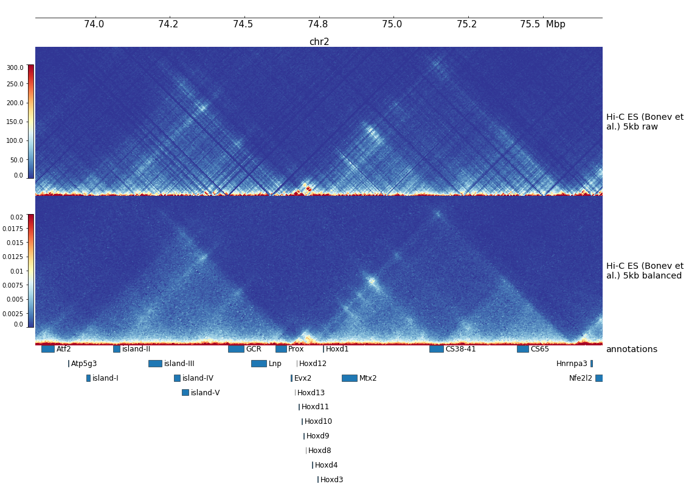
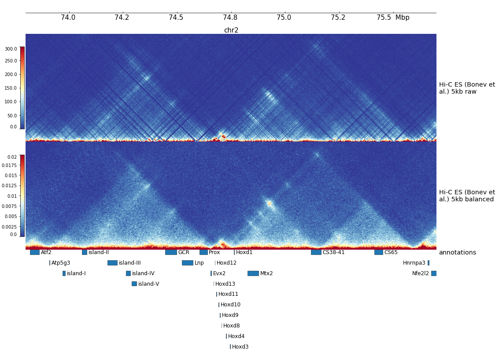

Hi-C reanalysis of some datasets from Bonev et al. 2017
=======================================================

This repository describes how data available on GEO [GSE161259](https://www.ncbi.nlm.nih.gov/geo/query/acc.cgi?acc=GSE161259) were generated and how people can generate heatmap for the region they want.

Table of content
----------------

* [Valid pairs generation](#valid-pair-generation)
* [How to generate heatmap](#how-to-generate-heatmap)
* [How to generate heatmap with low memory computer](#how-to-generate-heatmap-with-low-memory-computer)

Valid pair generation
---------------------

In order to easily use these datasets which are one of the Hi-C sequenced to the highest depth. I decided to remap 3 of the datasets published by [Bonev et al. 2007](https://doi.org/10.1016/j.cell.2017.09.043). I did it in October/November 2018 with the last version of HiCUP available at that time (version 0.6.1) using the facilities of the Scientific IT and Application Support Center of EPFL (slurm scheduler). All scripts used to generate the valid pairs are available in the folder scripts.

How to generate heatmap
-----------------------

I am going to describe here, step by step how you can use the valid pairs to generate the heatmap of your choice.

You will need to have cooler, tabix and bgzip (optionally pyGenomeTracks to display the heatmap at the end). The easiest way to have all of them is to use conda.

```bash
# Create a new environment named cooler with cooler installed
$ conda create -n cooler -c conda-forge -c bioconda cooler
# Before launching commands below you need to activate the environment
$ conda activate cooler
```

You will also need to download the mm10.size file and put its path in a variable:

```bash
sizes=/home/ldelisle/softwares/Hi-C_reanalysis_Bonev_2017/mm10.size
```

First, download the valid pair file corresponding to your dataset and your chromosome. For example ES chr2.

```bash
wget "ftp://ftp.ncbi.nlm.nih.gov/geo/series/GSE161nnn/GSE161259/suppl/GSE161259%5FES%5Fchr2%2EvalidPairs%2Ecsort%2Etxt%2Egz"
pairs="GSE161259_ES_chr2.validPairs.csort.txt.gz"
```

Then, index it using tabix:

```bash
tabix -s3 -b4 -e4 ${pairs}
```

Create the bins corresponding to the size you want (here 5kb) using the file mm10.size:

```bash
bin=5
cooler makebins ${sizes} "${bin}000" > mm10.${bin}kb.bins
```

Load the pairs into a matrix of fixed bins (cool file), this operation can take several minutes:

```bash
coolFile=${pairs/.validPairs.csort.gz/_raw.${bin}kb.cool}
cooler cload tabix -p 1 -c2 7 -p2 8 -s 2 --assembly mm10 mm10.${bin}kb.bins ${pairs} ${coolFile}
# If it fails because of memory or cpu error you can try to increase the number after -s, for example:
cooler cload tabix -p 1 -c2 7 -p2 8 -s 4 --assembly mm10 mm10.${bin}kb.bins ${pairs} ${coolFile}
```

If you want to balance the matrix (apply the ICE method to have the sum of each contact of a given bin equal to 1):

```bash
coolFileBalanced=${coolFile/_raw/}
# The command cooler balance modify the file
# If you want to keep both files, you need to make a copy
cp ${coolFile} ${coolFileBalanced}
cooler balance -p 1 --cis-only ${coolFileBalanced}
```

To see the heatmap you can use pyGenometracks.

To install it into your conda environment run:

```bash
conda install -c conda-forge -c bioconda 'pygenometracks>=3.5.1'
```

You need to generate a configuration file, the full documentation is [here](https://pygenometracks.readthedocs.io). Copy this file into a text file (example.ini), adapting to your case.

```ini
[x-axis]

[raw]
file = GSE161259_ES_chr2_raw.5kb.cool
depth = 1000000
title = Hi-C ES (Bonev et al.) 5kb raw
min_value = 0
max_value = 300

[balanced]
file = GSE161259_ES_chr2.5kb.cool
depth = 1000000
title = Hi-C ES (Bonev et al.) 5kb balanced
min_value = 0
max_value = 0.02

[annotations]
file = Hi-C_consensus_mm10_gene_bodies_enhancers_Paper.bed
title = annotations
all_labels_inside = true
height = 8
```

Then run the plotting command:

```bash
pgt --tracks example.ini --region chr2:73800000-75700000 -o example.png
```



How to generate heatmap with low memory computer
------------------------------------------------

If you tried the method above and you got some error messages like "Segmentation fault (core dumped)". You can still use the data. Instead of generating the matrix for a whole chromosome, you can use part of it. For example, the plotting region +-2Mb.

After getting the pairs and indexing them, we will sample them, keeping only pairs with both mates in the region of interest:

```bash
# Define the region you want to get pairs:
chrUsed=chr2
start=71000000
end=77000000
pairsOri=${pairs}
# Adjust the name of the new file
pairs=${pairs/.validPairs.csort.gz/}_${start}_${end}.validPairs.csort.gz
# Subset the file
tabix ${pairsOri} ${chrUsed}:${start}-${end} | awk -v cu=$chrUsed -v s=$start -v e=$end '$7==cu&&$8<e&&$8>s{print}' | bgzip > ${pairs}
# Index the new file
tabix -s3 -b4 -e4 ${pairs}
```

Then follow the classical tutorial with `cooler makebins`, `cooler cload` and `cooler balance`.

The picture will be very similar:


If you don't manage to run pyGenomeTracks (`pgt`), you can use the graphical version of pyGenomeTracks on [the galaxy european server](https://usegalaxy.eu/).
